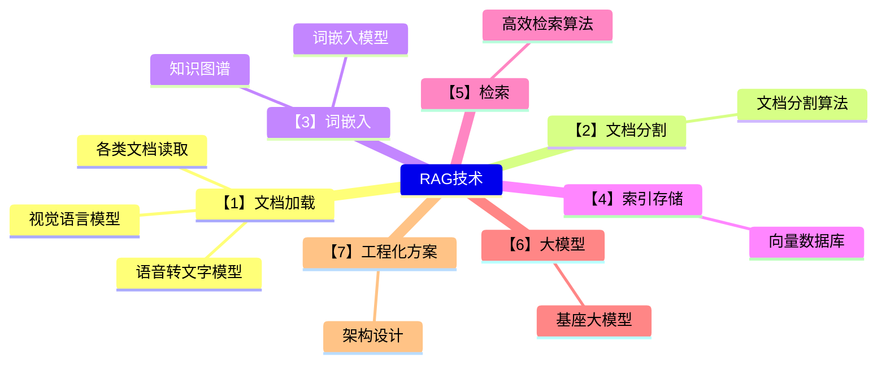

# RAG开发

## 学习资料
- 基于大模型的RAG应用开发与优化——构建企业级LLM应用
- 从零开始构建企业级RAG系统

## 关键技术

```mermaid
mindmap
RAG技术
    【1】文档加载
        各类文档读取
        语音转文字模型
        视觉语言模型
    【2】文档分割
        文档分割算法
    【3】词嵌入
        词嵌入模型
        知识图谱
    【4】索引存储
        向量数据库
    【5】检索
        高效检索算法
    【6】大模型
        基座大模型
    【7】工程化方案
        架构设计
```
